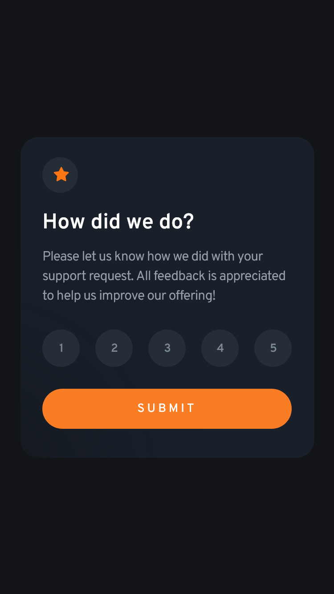
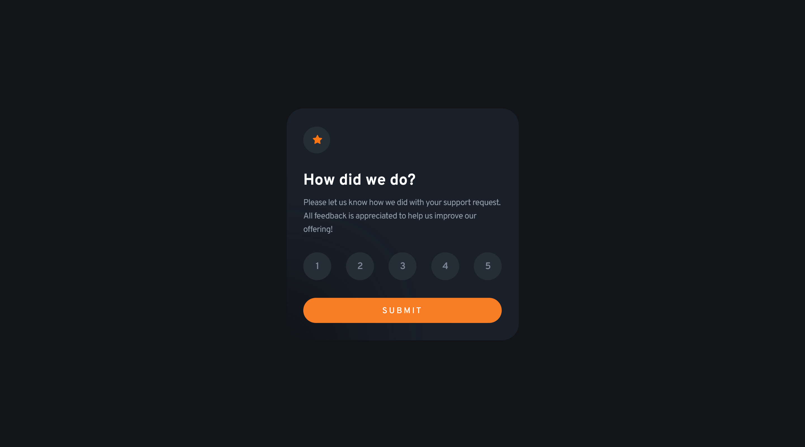

## Welcome! 👋🏼

# Frontend Mentor - Interactive Rating Component

[Frontend Mentor](https://www.frontendmentor.io) challenges help you improve your coding skills by building realistic projects

## Table of contents    

- [Overview](#overview)
  - [The challenge](#the-challenge)
  - [My Achievements](#my-achievements)
  - [Screenshot](#screenshot)
  - [Links](#links)
- [My process](#my-process)
  - [Built with](#built-with)
- [Author](#author)

## Overview

[This is an entry-level NEWBIE(Free) challenge that uses HTML, CSS & JS](https://www.frontendmentor.io/challenges/interactive-rating-component-koxpeBUmI)

## The challenge

- View the optimal layout for the site depending on their device's screen size
- See hover states for all interactive elements on the page
- Select and submit a number rating
- See the "Thank you" card state after submitting a rating

## My Achievements

- built the component almost close to the design provided.
- set hover states for interactive elements using CSS
- customized & added some extra features for elements using Javascript
    - component will give a simple feedback animation if rating is undone
    - set some animation functions for custom feedbacks

### Screenshot

- mobile-version 

 
- desktop-version  

### Links

- Solution URL: [Frontend Mentor Solution Page](https://www.frontendmentor.io/solutions/a-simple-rating-component-webpage-using-html-css-and-js-kJ-jmy39gF)
- Live Site URL: [GitHub Pages](https://m-lakshan.github.io/FM_Challenge-Interactive-Rating-Component/)

## My process

### Built with

- Semantic HTML5 markup
- CSS custom properties
- CSS Flexbox & Grid
- Mobile-first workflow
- custom interactions & validations using JS
- with Visual Studio Code Editor

## Author

- Frontend Mentor - [@M-lakshan](https://www.frontendmentor.io/profile/M-lakshan)
- Dev.to - [@mlakshan](https://dev.to/mlakshan)
